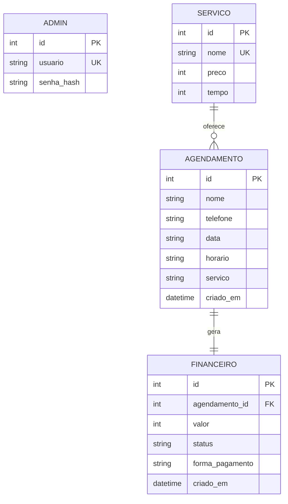

# 📘 Documentação de Engenharia de Software — Sistema HF Barbearia

**Versão:** 1.0.0  
**Data:** 02/08/2026  
**Autor:** HS Tech  
**Status:** Documentação Oficial do Projeto

---

## 1. Visão Geral do Sistema

### 1.1 Objetivo do Sistema

O sistema HF Barbearia tem como objetivo principal **automatizar o processo de agendamento de horários** em uma barbearia, permitindo que clientes realizem agendamentos online e que administradores gerenciem serviços, agendamentos e finanças através de um painel administrativo seguro.

### 1.2 Problema que Resolve

O sistema resolve os seguintes problemas:

- **Agendamento manual**: Elimina a necessidade de agendamentos por telefone ou presencialmente, permitindo que o cliente agende online.
- **Conflito de horários**: Impede que dois clientes agendem o mesmo horário no mesmo dia.
- **Gestão de serviços**: Centraliza o cadastro de serviços com preço e duração.
- **Controle financeiro**: Registra automaticamente o valor de cada agendamento e permite acompanhar o faturamento.
- **Acesso não autorizado**: Protege o painel administrativo com autenticação segura.

### 1.3 Público-Alvo

| Perfil | Descrição |
|--------|-----------|
| **Cliente** | Pessoas que desejam agendar horários na barbearia |
| **Administrador** | Proprietário ou funcionário responsável pela gestão da barbearia |

### 1.4 Benefícios

- Agendamento online 24/7
- Prevenção de conflitos de horário
- Gestão centralizada de serviços
- Controle financeiro automatizado
- Dashboard com indicadores do negócio
- Interface moderna e responsiva
- Segurança com autenticação e criptografia

### 1.5 Escopo do Projeto

**Dentro do escopo:**
- Agendamento de serviços online
- Gestão de serviços (CRUD)
- Gestão de agendamentos (listar/excluir)
- Controle financeiro (status, forma de pagamento, totais)
- Dashboard administrativo
- Autenticação de administrador

**Fora do escopo (atual):**
- Pagamento online (PIX, cartão)
- Múltiplos barbeiros
- Notificações por WhatsApp
- Aplicativo mobile

### 1.6 Limitações Atuais

- Banco de dados SQLite (não suporta múltiplos usuários simultâneos em escala)
- Sem pagamento online integrado
- Sem notificações automáticas
- Sem múltiplos profissionais
- Sem recuperação de senha
- Sem relatórios exportáveis

---

## 2. Levantamento de Requisitos

### 2.1 Requisitos Funcionais (RF)

| ID | Requisito | Descrição |
|----|-----------|-----------|
| RF01 | Visualizar serviços | O sistema deve permitir que o cliente visualize todos os serviços disponíveis com preço e duração |
| RF02 | Selecionar serviço | O sistema deve permitir que o cliente selecione um serviço para agendamento |
| RF03 | Realizar agendamento | O sistema deve permitir que o cliente preencha nome, telefone, data e horário |
| RF04 | Validar agendamento | O sistema deve validar todos os dados antes de salvar o agendamento |
| RF05 | Confirmar agendamento | O sistema deve exibir uma confirmação com os dados do agendamento |
| RF06 | Prevenir conflito de horário | O sistema deve impedir dois agendamentos no mesmo dia/horário |
| RF07 | Autenticar administrador | O sistema deve permitir login de administrador com usuário e senha |
| RF08 | Encerrar sessão | O sistema deve permitir logout do administrador |
| RF09 | Visualizar dashboard | O sistema deve exibir indicadores (agendamentos, faturamento, clientes) |
| RF10 | Listar agendamentos | O sistema deve listar todos os agendamentos no painel admin |
| RF11 | Excluir agendamento | O sistema deve permitir excluir um agendamento (e seu financeiro) |
| RF12 | Cadastrar serviço | O sistema deve permitir cadastrar novos serviços |
| RF13 | Editar serviço | O sistema deve permitir editar serviços existentes |
| RF14 | Excluir serviço | O sistema deve permitir excluir serviços |
| RF15 | Visualizar financeiro | O sistema deve listar registros financeiros com status e forma de pagamento |
| RF16 | Atualizar status financeiro | O sistema deve permitir atualizar status (pendente/pago/cancelado) |
| RF17 | Atualizar forma de pagamento | O sistema deve permitir definir forma de pagamento (dinheiro/cartão/pix) |
| RF18 | Calcular totais financeiros | O sistema deve calcular totais do dia, mês e ano |
| RF19 | Criar registro financeiro automático | O sistema deve criar registro financeiro ao criar agendamento |
| RF20 | Exibir mensagens de feedback | O sistema deve exibir mensagens de sucesso/erro (flash messages) |
| RF21 | Tratar erros HTTP | O sistema deve tratar erros 404, 500 e 400 |

### 2.2 Requisitos Não Funcionais (RNF)

| ID | Requisito | Descrição |
|----|-----------|-----------|
| RNF01 | Interface responsiva | O sistema deve funcionar em dispositivos móveis, tablets e desktops |
| RNF02 | Framework Flask | O sistema deve ser desenvolvido com Flask |
| RNF03 | Banco SQLite | O sistema deve utilizar SQLite como banco de dados |
| RNF04 | Senhas criptografadas | As senhas devem ser armazenadas com hash bcrypt |
| RNF05 | Proteção CSRF | Todos os formulários devem possuir proteção CSRF |
| RNF06 | Autenticação administrativa | O painel admin deve exigir autenticação |
| RNF07 | Arquitetura modular | O código deve ser organizado em módulos (models, routes, services) |
| RNF08 | Design moderno | O sistema deve utilizar Bootstrap 5 e design profissional |
| RNF09 | Fonte Poppins | O sistema deve utilizar a fonte Poppins (Google Fonts) |
| RNF10 | Animações suaves | O sistema deve possuir animações CSS suaves |
| RNF11 | Validação no servidor | Todas as validações devem ocorrer no servidor |
| RNF12 | Tratamento de erros | O sistema deve tratar erros HTTP com mensagens amigáveis |
| RNF13 | Variáveis de ambiente | Configurações sensíveis devem estar no arquivo .env |
| RNF14 | Documentação | O projeto deve possuir documentação (README, DOCUMENTACAO) |

---

## 3. Regras de Negócio

| ID | Regra | Implementação |
|----|-------|---------------|
| RN01 | Não permitir dois agendamentos no mesmo horário | Verificação de conflito em `verificar_conflito_horario()` |
| RN02 | Somente administradores autenticados acessam o painel | Função `login_necessario()` em todas as rotas admin |
| RN03 | Telefone deve seguir padrão brasileiro | Regex `^\(?\d{2}\)?\s?\d{4,5}-?\d{4}$` |
| RN04 | Data não pode ser anterior ao dia atual | Validação em `validar_data()` |
| RN05 | Serviço precisa existir no banco | Verificação em `servico_existe_no_banco()` |
| RN06 | Horário deve estar na lista permitida | Validação em `validar_horario()` |
| RN07 | Nome é obrigatório | Validação de campo não vazio |
| RN08 | Cada agendamento gera um registro financeiro | Criação automática em `criar_agendamento()` |
| RN09 | Excluir agendamento remove financeiro associado | Exclusão em cascata em `excluir_agendamento()` |
| RN10 | Status financeiro padrão é "pendente" | Default no modelo Financeiro |
| RN11 | Forma de pagamento é opcional | Campo nullable no modelo Financeiro |
| RN12 | Serviço não pode ter nome duplicado | `unique=True` na coluna nome |
| RN13 | Preço deve ser >= 0 | Validação no CRUD de serviços |
| RN14 | Tempo deve ser >= 1 minuto | Validação no CRUD de serviços |
| RN15 | Usuário admin é único | `unique=True` na coluna usuario |

---

## 4. Casos de Uso

### 4.1 UC01 — Cadastrar Agendamento

| Campo | Descrição |
|-------|-----------|
| **Nome** | Cadastrar Agendamento |
| **Objetivo** | Permitir que o cliente agende um horário |
| **Ator** | Cliente |
| **Pré-condições** | Serviço existente no banco |
| **Fluxo Principal** | 1. Cliente acessa a página inicial<br>2. Seleciona um serviço<br>3. Preenche nome, telefone, data e horário<br>4. Sistema valida os dados<br>5. Sistema salva agendamento e financeiro<br>6. Sistema exibe confirmação |
| **Fluxo Alternativo** | 3a. Dados inválidos → sistema exibe mensagem de erro<br>4a. Conflito de horário → sistema informa e solicita novo horário |
| **Pós-condições** | Agendamento salvo no banco com registro financeiro |

### 4.2 UC02 — Consultar Serviços

| Campo | Descrição |
|-------|-----------|
| **Nome** | Consultar Serviços |
| **Objetivo** | Visualizar serviços disponíveis |
| **Ator** | Cliente |
| **Pré-condições** | Nenhuma |
| **Fluxo Principal** | 1. Cliente acessa a página inicial<br>2. Sistema exibe cards com serviços, preços e durações |
| **Pós-condições** | Cliente visualiza todos os serviços |

### 4.3 UC03 — Login

| Campo | Descrição |
|-------|-----------|
| **Nome** | Login do Administrador |
| **Objetivo** | Autenticar administrador no painel |
| **Ator** | Administrador |
| **Pré-condições** | Admin cadastrado no banco |
| **Fluxo Principal** | 1. Admin acessa /admin/login<br>2. Preenche usuário e senha<br>3. Sistema verifica credenciais com bcrypt<br>4. Sistema cria sessão<br>5. Sistema redireciona para dashboard |
| **Fluxo Alternativo** | 3a. Credenciais inválidas → sistema exibe erro |
| **Pós-condições** | Admin autenticado com sessão ativa |

### 4.4 UC04 — Logout

| Campo | Descrição |
|-------|-----------|
| **Nome** | Logout do Administrador |
| **Objetivo** | Encerrar sessão do administrador |
| **Ator** | Administrador |
| **Pré-condições** | Admin autenticado |
| **Fluxo Principal** | 1. Admin clica em "Sair"<br>2. Sistema remove dados da sessão<br>3. Sistema redireciona para login |
| **Pós-condições** | Sessão encerrada |

### 4.5 UC05 — Cadastrar Serviço

| Campo | Descrição |
|-------|-----------|
| **Nome** | Cadastrar Serviço |
| **Objetivo** | Adicionar novo serviço |
| **Ator** | Administrador |
| **Pré-condições** | Admin autenticado |
| **Fluxo Principal** | 1. Admin acessa /admin/servicos<br>2. Preenche nome, preço e tempo<br>3. Sistema valida dados<br>4. Sistema salva serviço |
| **Fluxo Alternativo** | 3a. Nome duplicado → sistema exibe erro |
| **Pós-condições** | Serviço disponível para agendamento |

### 4.6 UC06 — Editar Serviço

| Campo | Descrição |
|-------|-----------|
| **Nome** | Editar Serviço |
| **Objetivo** | Alterar dados de um serviço |
| **Ator** | Administrador |
| **Pré-condições** | Admin autenticado, serviço existente |
| **Fluxo Principal** | 1. Admin clica em "Editar"<br>2. Sistema exibe formulário preenchido<br>3. Admin altera dados<br>4. Sistema salva alterações |
| **Pós-condições** | Serviço atualizado |

### 4.7 UC07 — Excluir Serviço

| Campo | Descrição |
|-------|-----------|
| **Nome** | Excluir Serviço |
| **Objetivo** | Remover um serviço |
| **Ator** | Administrador |
| **Pré-condições** | Admin autenticado, serviço existente |
| **Fluxo Principal** | 1. Admin clica em "Excluir"<br>2. Sistema remove serviço do banco |
| **Pós-condições** | Serviço removido |

### 4.8 UC08 — Consultar Financeiro

| Campo | Descrição |
|-------|-----------|
| **Nome** | Consultar Financeiro |
| **Objetivo** | Visualizar registros financeiros e totais |
| **Ator** | Administrador |
| **Pré-condições** | Admin autenticado |
| **Fluxo Principal** | 1. Admin acessa /admin/financeiro<br>2. Sistema exibe totais (dia/mês/ano)<br>3. Sistema exibe tabela de registros |
| **Pós-condições** | Admin visualiza dados financeiros |

### 4.9 UC09 — Excluir Agendamento

| Campo | Descrição |
|-------|-----------|
| **Nome** | Excluir Agendamento |
| **Objetivo** | Remover um agendamento e seu financeiro |
| **Ator** | Administrador |
| **Pré-condições** | Admin autenticado, agendamento existente |
| **Fluxo Principal** | 1. Admin clica em "Excluir"<br>2. Sistema remove financeiro associado<br>3. Sistema remove agendamento |
| **Pós-condições** | Agendamento e financeiro removidos |

### 4.10 UC10 — Atualizar Status Financeiro

| Campo | Descrição |
|-------|-----------|
| **Nome** | Atualizar Status Financeiro |
| **Objetivo** | Alterar status e forma de pagamento |
| **Ator** | Administrador |
| **Pré-condições** | Admin autenticado, registro financeiro existente |
| **Fluxo Principal** | 1. Admin seleciona status e forma de pagamento<br>2. Sistema salva alterações |
| **Pós-condições** | Registro financeiro atualizado |

---

## 5. Atores

| Ator | Descrição | Permissões |
|------|-----------|------------|
| **Cliente** | Usuário final que agenda serviços | Visualizar serviços, agendar, ver confirmação |
| **Administrador** | Gestor da barbearia | Acesso total ao painel admin |
| **Sistema** | Processa validações e regras de negócio | Automático |

---

## 6. Fluxo do Sistema

```
CLIENTE
    │
    ├── Acessa página inicial
    │   ├── Visualiza serviços (cards com preço e duração)
    │   └── Clica em "Agendar"
    │
    ├── Formulário de agendamento
    │   ├── Dados do serviço (readonly)
    │   ├── Nome, telefone, data, horário
    │   └── Envia formulário
    │
    ├── Validação (servidor)
    │   ├── Serviço existe?
    │   ├── Nome preenchido?
    │   ├── Telefone válido? (regex)
    │   ├── Data futura?
    │   ├── Horário permitido?
    │   └── Conflito de horário?
    │
    ├── Banco de Dados
    │   ├── Salva agendamento
    │   └── Cria registro financeiro (status: pendente)
    │
    └── Confirmação
        └── Exibe dados do agendamento

ADMINISTRADOR
    │
    ├── Login (/admin/login)
    │   ├── Usuário + senha
    │   └── Verificação bcrypt
    │
    ├── Dashboard (/admin)
    │   ├── Agendamentos hoje/mês
    │   ├── Serviços cadastrados
    │   ├── Clientes atendidos
    │   ├── Faturamento hoje/mês
    │   └── Últimos agendamentos
    │
    ├── Agendamentos (/admin/agendamentos)
    │   ├── Listar todos
    │   └── Excluir (remove financeiro associado)
    │
    ├── Serviços (/admin/servicos)
    │   ├── Listar
    │   ├── Adicionar
    │   ├── Editar
    │   └── Excluir
    │
    └── Financeiro (/admin/financeiro)
        ├── Totais (dia/mês/ano)
        ├── Listar registros
        └── Atualizar status e forma de pagamento
```

---

## 7. Banco de Dados

### 7.1 Tabela: servico

| Campo | Tipo | Restrições | Descrição |
|-------|------|------------|-----------|
| id | Integer | PK, auto-incremento | Identificador único |
| nome | String(100) | UNIQUE, NOT NULL | Nome do serviço |
| preco | Integer | NOT NULL | Preço em reais |
| tempo | Integer | NOT NULL | Duração em minutos |

**Objetivo:** Armazenar os serviços oferecidos pela barbearia.

### 7.2 Tabela: agendamento

| Campo | Tipo | Restrições | Descrição |
|-------|------|------------|-----------|
| id | Integer | PK, auto-incremento | Identificador único |
| nome | String(100) | NOT NULL | Nome do cliente |
| telefone | String(20) | NOT NULL | Telefone do cliente |
| data | String(10) | NOT NULL | Data (YYYY-MM-DD) |
| horario | String(5) | NOT NULL | Horário (HH:MM) |
| servico | String(100) | NOT NULL | Nome do serviço |
| criado_em | DateTime | default=utcnow | Data de criação |

**Objetivo:** Armazenar os agendamentos realizados.

### 7.3 Tabela: admin

| Campo | Tipo | Restrições | Descrição |
|-------|------|------------|-----------|
| id | Integer | PK, auto-incremento | Identificador único |
| usuario | String(50) | UNIQUE, NOT NULL | Nome de usuário |
| senha_hash | String(255) | NOT NULL | Hash bcrypt da senha |

**Objetivo:** Armazenar credenciais de administradores.

### 7.4 Tabela: financeiro

| Campo | Tipo | Restrições | Descrição |
|-------|------|------------|-----------|
| id | Integer | PK, auto-incremento | Identificador único |
| agendamento_id | Integer | FK → agendamento.id, UNIQUE, NOT NULL | Agendamento relacionado |
| valor | Integer | NOT NULL | Valor do serviço |
| status | String(20) | NOT NULL, default="pendente" | pendente/pago/cancelado |
| forma_pagamento | String(20) | NULL | dinheiro/cartao/pix |
| criado_em | DateTime | default=utcnow | Data de criação |

**Objetivo:** Armazenar registros financeiros de agendamentos.

### 7.5 Relacionamentos

```
servico ──(1:N)── agendamento (via nome do serviço)
agendamento ──(1:1)── financeiro (via agendamento_id)
admin ──(independente)
```

---

## 8. Arquitetura

### 8.1 Camadas

| Camada | Responsabilidade |
|--------|------------------|
| **app.py** | Factory pattern, configuração, registro de blueprints, error handlers |
| **config.py** | Configurações centralizadas (SECRET_KEY, SQLALCHEMY_DATABASE_URI) |
| **models/** | Definição das tabelas do banco (Servico, Agendamento, Admin, Financeiro) |
| **routes/** | Blueprints com rotas (main: públicas, admin: administrativas) |
| **services/** | Lógica de negócio (validações, consultas, criação) |
| **templates/** | Templates HTML com Jinja2 |
| **static/** | CSS, imagens |

### 8.2 Blueprints

- **main_bp**: Rotas públicas (/, /agendamento)
- **admin_bp**: Rotas administrativas com prefixo /admin

### 8.3 Factory Pattern

O `create_app()` centraliza a criação da aplicação, permitindo:
- Configuração centralizada
- Inicialização de extensões (db, csrf, bcrypt)
- Registro de blueprints
- Tratamento de erros
- Criação do banco e dados iniciais

---

## 9. Estrutura de Diretórios

```
barbearia_hf/
├── .env                      # Variáveis de ambiente (SECRET_KEY)
├── .gitignore                # Arquivos ignorados pelo Git
├── app.py                    # Factory da aplicação
├── config.py                 # Configurações
├── README.md                 # Documentação principal
├── DOCUMENTACAO.md           # Documentação de engenharia
├── requirements.txt          # Dependências
├── models/
│   ├── __init__.py           # db = SQLAlchemy()
│   ├── servico.py            # Modelo Servico
│   ├── agendamento.py        # Modelo Agendamento
│   ├── admin.py              # Modelo Admin
│   └── financeiro.py         # Modelo Financeiro
├── routes/
│   ├── __init__.py           # Blueprints
│   ├── main.py               # Rotas públicas
│   └── admin.py              # Rotas administrativas
├── services/
│   ├── __init__.py
│   └── barbearia_service.py  # Lógica de negócio
├── static/
│   ├── style.css             # Design system
│   └── imagens/              # Imagens
└── templates/
    ├── index.html            # Página inicial
    ├── agendamento.html      # Formulário
    ├── confirmacao.html      # Confirmação
    ├── admin_base.html       # Layout admin
    ├── admin_login.html      # Login
    ├── admin_dashboard.html  # Dashboard
    ├── admin_agendamentos.html # Agendamentos
    ├── admin_servicos.html   # Serviços
    └── admin_financeiro.html # Financeiro
```

---

## 10. Tecnologias Utilizadas

| Tecnologia | Por que foi utilizada |
|------------|----------------------|
| **Python 3.13** | Linguagem de programação principal, simples e poderosa |
| **Flask 3.1.3** | Framework web leve e flexível, ideal para projetos de médio porte |
| **SQLite** | Banco de dados embutido, sem necessidade de servidor externo |
| **SQLAlchemy 2.0** | ORM que abstrai o banco, permitindo trabalhar com objetos Python |
| **Flask-SQLAlchemy** | Integração do SQLAlchemy com Flask |
| **Flask-WTF** | Proteção CSRF automática em formulários |
| **Flask-Bcrypt** | Criptografia segura de senhas |
| **Bootstrap 5** | Framework CSS para design responsivo e moderno |
| **Bootstrap Icons** | Ícones profissionais |
| **Google Fonts (Poppins)** | Tipografia moderna e legível |
| **python-dotenv** | Gerenciamento de variáveis de ambiente |
| **Jinja2** | Template engine do Flask para renderização HTML |

---

## 11. Segurança

### 11.1 CSRF
- Todos os formulários POST possuem token CSRF
- Flask-WTF valida o token em cada requisição
- Erro 400 é tratado com mensagem amigável

### 11.2 Hash BCrypt
- Senhas armazenadas como hash bcrypt
- `generate_password_hash()` para criar
- `check_password_hash()` para verificar
- Senha nunca armazenada em texto puro

### 11.3 Sessões
- Sessão Flask com cookies assinados
- `session["admin_id"]` e `session["admin_usuario"]`
- Logout remove dados da sessão

### 11.4 Login
- Verificação de credenciais com bcrypt
- Mensagens de erro genéricas (não revela se usuário ou senha está errado)

### 11.5 Validação de Entrada
- Nome: obrigatório, não vazio
- Telefone: regex brasileiro
- Data: formato YYYY-MM-DD, não pode ser passado
- Horário: lista permitida
- Serviço: deve existir no banco

### 11.6 Tratamento de Erros
- 404: redireciona com mensagem
- 500: redireciona com mensagem
- 400: redireciona com mensagem

### 11.7 Proteção das Rotas Administrativas
- `login_necessario()` verifica sessão em todas as rotas admin
- Redireciona para login se não autenticado

---

## 12. Modelo de Dados (Diagrama ER)



---

## 13. Fluxos do Usuário

### 13.1 Fluxo do Cliente

1. Acessa a página inicial
2. Visualiza os serviços disponíveis
3. Clica em "Agendar" em um serviço
4. Preenche o formulário (nome, telefone, data, horário)
5. Sistema valida os dados
6. Sistema salva o agendamento e cria registro financeiro
7. Sistema exibe a confirmação

### 13.2 Fluxo do Administrador

1. Acessa /admin/login
2. Faz login com usuário e senha
3. Visualiza o dashboard com indicadores
4. Gerencia agendamentos (listar/excluir)
5. Gerencia serviços (CRUD)
6. Gerencia financeiro (status, forma de pagamento)
7. Faz logout

---

## 14. Interfaces

### 14.1 Página Inicial (index.html)
- Navbar com logo e navegação
- Hero section com título e botões
- Cards de serviços com preço e duração
- Footer com contato e horários

### 14.2 Agendamento (agendamento.html)
- Navbar com botão voltar
- Card com dados do serviço (readonly)
- Formulário com nome, telefone, data, horário
- Botão de confirmação

### 14.3 Confirmação (confirmacao.html)
- Ícone de sucesso
- Título "Agendamento Confirmado"
- Linhas com dados do agendamento
- Botão voltar ao início

### 14.4 Login (admin_login.html)
- Card centralizado
- Ícone de cadeado
- Campos de usuário e senha
- Botão entrar

### 14.5 Dashboard (admin_dashboard.html)
- Header com título
- 6 cards de indicadores
- Tabela dos últimos agendamentos

### 14.6 Serviços (admin_servicos.html)
- Formulário de cadastro/edição
- Tabela de serviços com ações

### 14.7 Financeiro (admin_financeiro.html)
- 3 cards de totais (dia/mês/ano)
- Tabela de registros com selects para status e forma de pagamento

### 14.8 Agendamentos (admin_agendamentos.html)
- Tabela com todos os agendamentos
- Botão excluir em cada linha

---

## 15. Validações

| Validação | Onde | Regra |
|-----------|------|-------|
| Telefone | routes/main.py | Regex `^\(?\d{2}\)?\s?\d{4,5}-?\d{4}$` |
| Data | services | Formato YYYY-MM-DD, não pode ser passado |
| Horário | services | Deve estar na lista permitida |
| Serviço | services | Deve existir no banco |
| Nome | routes/main.py | Não pode ser vazio |
| Login | routes/admin.py | Usuário e senha obrigatórios |
| Sessão | routes/admin.py | `login_necessario()` em rotas admin |
| CSRF | Flask-WTF | Token em todos os formulários POST |
| Preço serviço | routes/admin.py | Deve ser >= 0 |
| Tempo serviço | routes/admin.py | Deve ser >= 1 |
| Nome serviço | routes/admin.py | Não pode ser vazio, não duplicado |
| Status financeiro | routes/admin.py | Deve ser pendente/pago/cancelado |
| Forma pagamento | routes/admin.py | Deve ser dinheiro/cartao/pix/vazio |

---

## 16. Relatório Técnico

### 16.1 Pontos Fortes

- ✅ Arquitetura modular e organizada
- ✅ Factory pattern para criação da aplicação
- ✅ Blueprints para separação de rotas
- ✅ Separação de concerns (models, routes, services)
- ✅ Validações robustas no servidor
- ✅ Proteção CSRF em todos os formulários
- ✅ Senhas criptografadas com bcrypt
- ✅ Tratamento de erros HTTP
- ✅ Design moderno e responsivo
- ✅ Documentação completa

### 16.2 Pontos Fracos

- ⚠️ Banco SQLite não escala para múltiplos usuários simultâneos
- ⚠️ Sem pagamento online integrado
- ⚠️ Sem notificações automáticas
- ⚠️ Sem múltiplos profissionais
- ⚠️ Sem recuperação de senha
- ⚠️ Sem relatórios exportáveis
- ⚠️ Sem testes automatizados

### 16.3 Oportunidades de Melhoria

- Migrar para PostgreSQL/MySQL
- Implementar pagamento online (PIX, cartão)
- Adicionar notificações por WhatsApp
- Implementar múltiplos barbeiros
- Adicionar testes automatizados (pytest)
- Implementar relatórios exportáveis (CSV/PDF)
- Adicionar gráficos no dashboard

### 16.4 Riscos Técnicos

- SQLite pode ter problemas de concorrência
- Senha padrão "admin123" deve ser alterada em produção
- Dependência de CDN (Bootstrap, Google Fonts) requer internet
- Sem backup automático do banco

### 16.5 Escalabilidade

- Arquitetura modular facilita expansão
- SQLite limita escalabilidade (migrar para PostgreSQL)
- Blueprints permitem adicionar novos módulos facilmente

### 16.6 Manutenibilidade

- Código bem organizado e comentado
- Separação clara de responsabilidades
- Nomes de funções descritivos
- Documentação completa

### 16.7 Performance

- Consultas simples e otimizadas
- SQLite é rápido para pequenos volumes
- Sem consultas N+1 significativas

### 16.8 Segurança

- CSRF protegido
- Senhas com bcrypt
- Sessão segura
- Validação de entrada
- Tratamento de erros

---

## 17. Roadmap

### Versão 1.1 (Funcionalidades Existentes)
- ✅ Agendamento online
- ✅ Gestão de serviços (CRUD)
- ✅ Gestão de agendamentos
- ✅ Módulo financeiro
- ✅ Dashboard
- ✅ Autenticação

### Versão 1.2 (Planejado)
- [ ] Relatório de agendamentos por período
- [ ] Gráficos no dashboard
- [ ] Exportar relatório financeiro em CSV
- [ ] Cancelamento de agendamento pelo cliente
- [ ] Testes automatizados (pytest)

### Versão 2.0 (Planejado)
- [ ] Múltiplos barbeiros/profissionais
- [ ] Notificações por WhatsApp
- [ ] Upload de foto de perfil
- [ ] Histórico de agendamentos por cliente
- [ ] Migração para PostgreSQL

### Versão 3.0 (Planejado)
- [ ] Integração com PIX (QR Code)
- [ ] Pagamento online com cartão
- [ ] Aplicativo mobile (PWA)
- [ ] API REST
- [ ] Autenticação com Google/WhatsApp

---

## 18. Conclusão

### Avaliação Geral

| Critério | Avaliação |
|----------|-----------|
| **Arquitetura** | ⭐⭐⭐⭐⭐ Modular, com separação clara de responsabilidades |
| **Organização** | ⭐⭐⭐⭐⭐ Estrutura de pastas lógica e padronizada |
| **Qualidade do Código** | ⭐⭐⭐⭐⭐ Código limpo, comentado e legível |
| **Segurança** | ⭐⭐⭐⭐⭐ CSRF, bcrypt, sessão, validação de entrada |
| **Escalabilidade** | ⭐⭐⭐⭐ Modular, mas limitado pelo SQLite |
| **Boas Práticas** | ⭐⭐⭐⭐⭐ Factory pattern, blueprints, services |
| **Legibilidade** | ⭐⭐⭐⭐⭐ Nomes descritivos, comentários claros |
| **Documentação** | ⭐⭐⭐⭐⭐ README + Documentação de Engenharia |

### Considerações Finais

O sistema HF Barbearia apresenta **alta qualidade técnica** e está **pronto para produção** em pequena escala. A arquitetura modular permite expansão gradual, e as boas práticas de segurança garantem proteção adequada dos dados.

**Recomendações para produção:**
1. Alterar a senha padrão do admin
2. Configurar `FLASK_DEBUG=false`
3. Utilizar um servidor WSGI (gunicorn/waitress)
4. Realizar backup regular do banco
5. Considerar migração para PostgreSQL em escala maior

---

*Documentação gerada em 02/08/2026 — HS Tech*